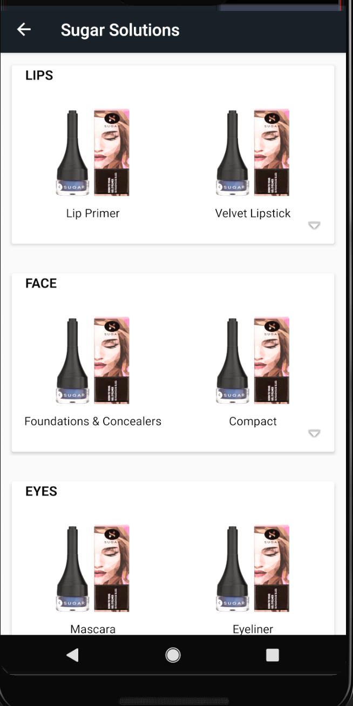
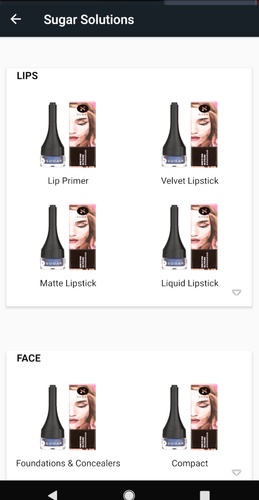
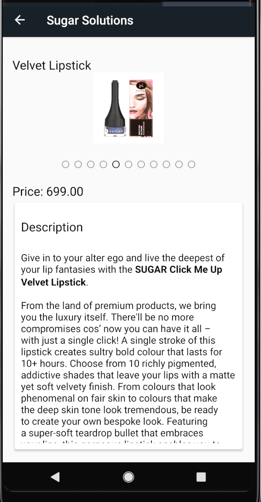

# SugarSolutionsAttempt

Sharing App Screen Shots
 
   
  
   
   

Instruction to Run this App

<ul>
 <li>Download Whole Project</li>
 <li>Open Android Studio</li>
 <li>Open Exesting Project -> Navigate To Downloaded Folder And Select Project Dir.</li>
 <li>Sync Gradle and Run Project</li>
</ul>
